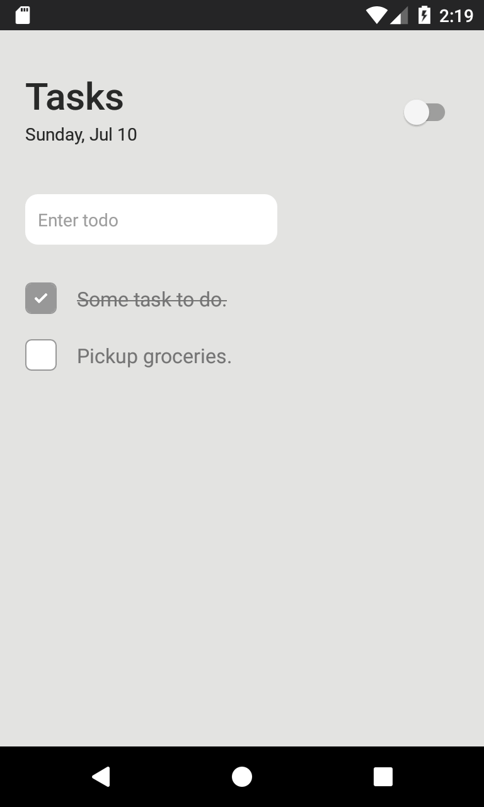

# Minimal Todo Android App

## Screenshots

## Development
- The application is developed using react-native
- It includes dark mode.
- The application is used to store the task in local storage.
- To interact with tasks:
  - Press to do/undo the task.
  - Long press to delete the task.
- The additional packages used in the app are-
  - react-native-async-storage (for storing tasks in local storage)
  - react-native-paper (for designing the basic layout)
  - react-native-boncy checkbox (for implementing animated checkbox)
